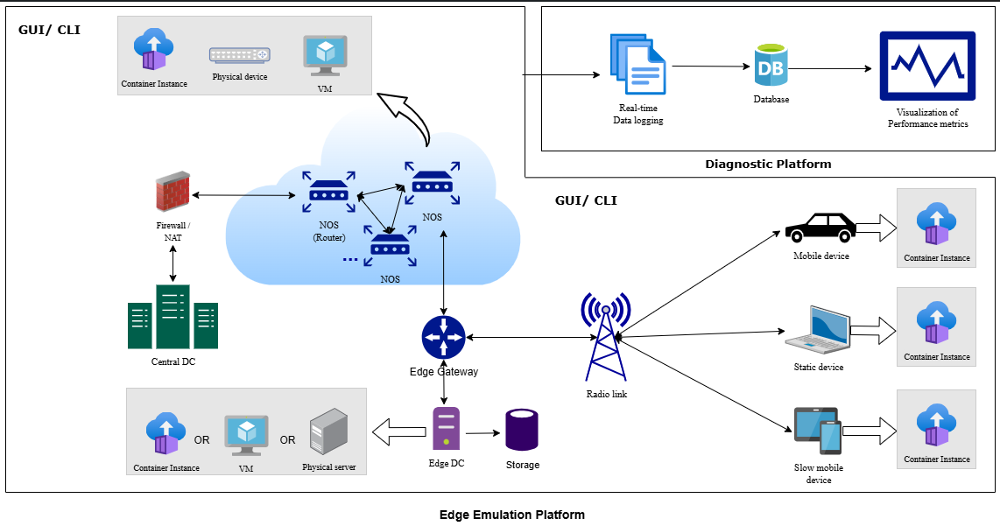

# EMULATE – Edge Emulation Platform

Welcome to the official GitHub page for **Edge-Emulator**, focusing specifically on the Emulation Platform, a core component of the [EMULATE Project](https://www.fh-dortmund.de/microsite/smartedgelab/projekte/emulate.php). The EMULATE initiative develops advanced solutions for measuring, analyzing, and optimizing edge service performance within Europe's evolving cloud-edge continuum.

## Project Overview

Real-time processing applications—such as autonomous driving, augmented reality, smart grid management, and drone operations—are increasingly relying on edge computing, where data is processed close to its source rather than at distant cloud centers.

EMULATE addresses a critical gap in edge computing adoption by providing essential tools:

### Edge Emulation Platform
The Emulation Platform enables the creation of digital twins of real-world edge environments, including infrastructures, applications, and scenarios. This platform allows developers and researchers to rigorously test deployment scenarios and evaluate the performance of edge computing architectures under various realistic conditions.

#### Key Features:
- Built upon Containerlab for network emulation
- Integration of lightweight Kubernetes clusters (K3s)
- Kubernetes Without Kubelet (KWOK) for workload simulation
- Multi-cluster federation capabilities via LIQO
- 5G Standalone (SA) Network Emulation using Open5GS and UERANSIM

The platform supports research scenarios, including:
- User mobility simulation between cells using Xn-based handover between gNBs to maintain connectivity during mobility

### Diagnostic Platform
Complementing the Emulation Platform, the Diagnostic Platform provides analysis and performance metrics, identifying potential bottlenecks and ensuring quality-of-service for real-time edge applications.

A representative implementation of the project is depicted in the figure below.

## Project Context and Collaboration
EMULATE is part of the European initiative "Important Project of Common European Interest – Next Generation Cloud Infrastructure" (IPCEI-CIS), aimed at developing a unified, multi-provider cloud-edge continuum branded as "8ra (ORA)". The project actively collaborates with industry leaders in telecommunications, automotive, and embedded electronics to ensure real-world relevance and applicability.

We encourage engagement from academic and industry communities interested in contributing to cutting-edge developments in edge computing performance and optimization.

## Publications
- Urwah Muslim and Stephan Recker. "A Comparative Analysis of Digital Twins for Advanced Networks." IEEE 7th International Conference and Workshop Óbuda on Electrical and Power Engineering (CANDO-EPE), pp. 281–286, 2024. [DOI: 10.1109/CANDO-EPE65072.2024.10772762](https://doi.org/10.1109/CANDO-EPE65072.2024.10772762)
- Urwah Muslim and Stephan Recker. “Demo: Emulation Platform to Build Digital Twins of Edge Computing Environments” IEEE/ACM Symposium on Edge Computing (SEC), pp. 512–514, 2024. [DOI: 10.1109/SEC62691.2024.00062](https://doi.org/10.1109/SEC62691.2024.00062)

For comprehensive information, and detailed project updates, visit the [official EMULATE project page](https://www.fh-dortmund.de/microsite/smartedgelab/projekte/emulate.php).
